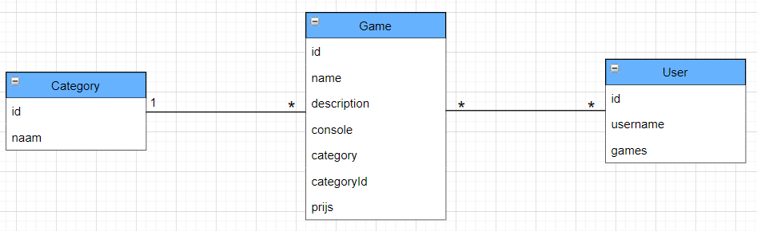
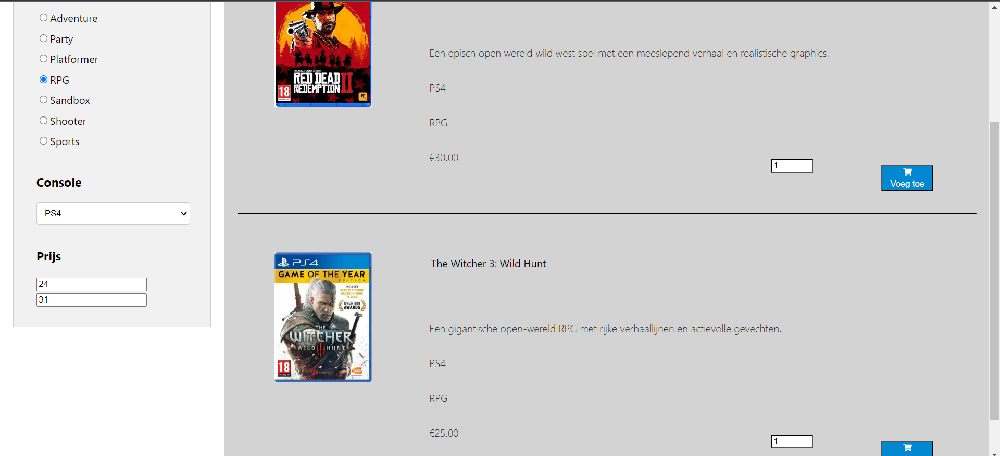
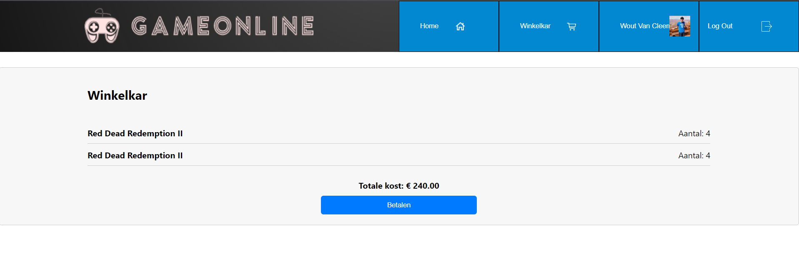
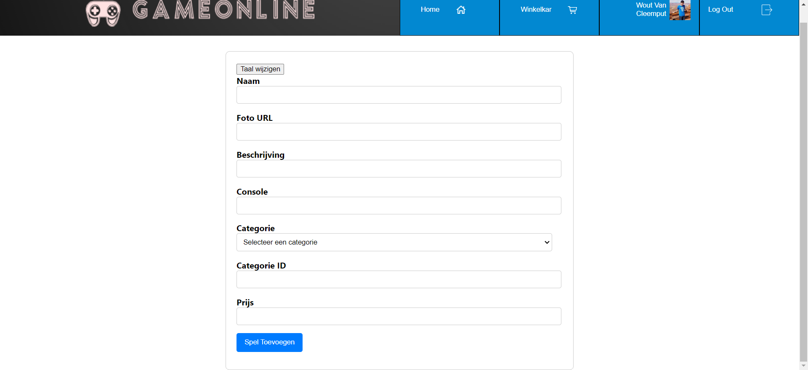
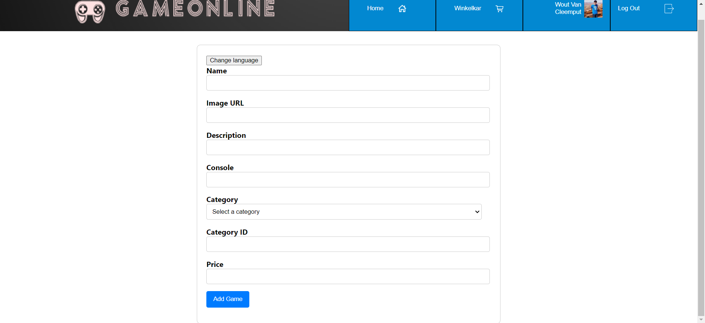
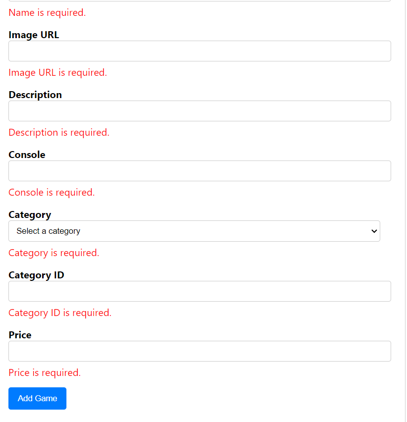
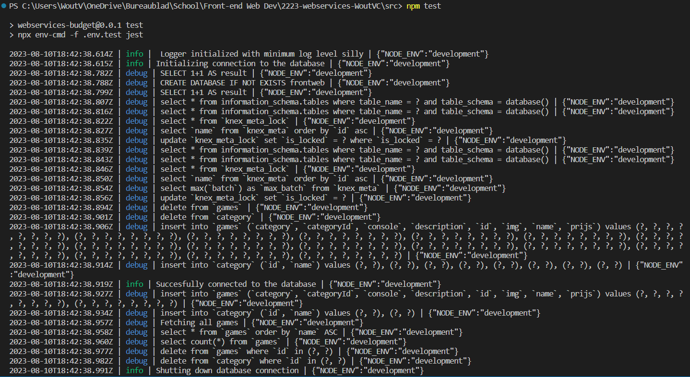
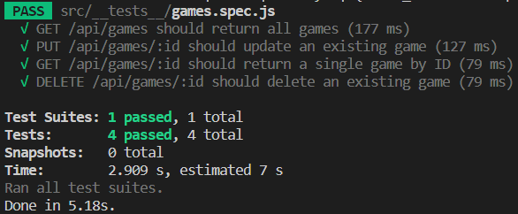

# Voornaam Familienaam (Studentennummer)

- [X] Web Services: [GITHUB URL](https://github.com/Web-IV/2223-webservices-WoutVC/tree/main)
  - [GitHub repository](github.com/HOGENT-Web)
  - [Online versie](github.com/HOGENT-Web)

**Logingegevens**

- Gebruikersnaam/e-mailadres: e2e-testing@gameapp.be
- Wachtwoord: Test1234!

> Vul eventueel aan met extra accounts voor administrators of andere rollen.

## Projectbeschrijving

> Omschrijf hier duidelijk waarover jouw project gaat. Voeg een domeinmodel (of EERD) toe om jouw entiteiten te verduidelijken.

Mijn project gaat over een website dat games verkoopt. 

## Screenshots

> Voeg enkele (nuttige!) screenshots toe die tonen wat de app doet.

## API calls

> Maak hier een oplijsting van alle API cals in jouw applicatie. Groepeer dit per entiteit. Hieronder een voorbeeld.
> Dit is weinig zinvol indien je enkel Front-end Web Development volgt, verwijder dan deze sectie.
> Indien je als extra Swagger koos, dan voeg je hier een link toe naar jouw online documentatie. Swagger geeft nl. exact (en nog veel meer) wat je hieronder moet schrijven.

### Gebruikers

- `GET /api/users`: alle gebruikers ophalen
- `GET /api/users/:id`: gebruiker met een bepaald id ophalen

## Behaalde minimumvereisten

### Web Services

- **datalaag**

  - [X] voldoende complex (meer dan één tabel, 2 een-op-veel of veel-op-veel relaties)
  - [X] één module beheert de connectie + connectie wordt gesloten bij sluiten server
  - [X] heeft migraties - indien van toepassing
  - [X] heeft seeds
 

- **repositorylaag**

  - [X] definieert één repository per entiteit (niet voor tussentabellen) - indien van toepassing
  - [X] mapt OO-rijke data naar relationele tabellen en vice versa - indien van toepassing
 

- **servicelaag met een zekere complexiteit**

  - [X] bevat alle domeinlogica
  - [X] bevat geen SQL-queries of databank-gerelateerde code
 

- **REST-laag**

  - [X] meerdere routes met invoervalidatie
  - [X] degelijke foutboodschappen
  - [X] volgt de conventies van een RESTful API
  - [X] bevat geen domeinlogica
  - [X] geen API calls voor entiteiten die geen zin hebben zonder hun ouder (bvb tussentabellen)
  - [ ] degelijke authorisatie/authenticatie op alle routes
 

- **algemeen**

  - [ ] er is een minimum aan logging voorzien
  - [X] een aantal niet-triviale integratietesten (min. 1 controller >=80% coverage)
  - [X] minstens één extra technologie
  - [ ] maakt gebruik van de laatste ES-features (async/await, object destructuring, spread operator...)
  - [ ] duidelijke en volledige README.md
  - [X] volledig en tijdig ingediend dossier en voldoende commits (de meeste commits zijn nog van vorig jaar https://github.com/Web-IV/2223-webservices-WoutVC)

## Projectstructuur

### Web Services

C:.
|   createServer.js
|   index.js
|   
+---core
|       logging.js
|       serviceError.js
|       
+---data
|   |   index.js
|   |   
|   +---migrations
|   |       202212201521_createGameTable.js
|   |       202304251635_createCategoryTable.js
|   |       
|   \---seeds
|           202105251900_resetDb.js
|           202212201527_games.js
|           202304251636_category.js
|
+---models
|       Category.js
|       Game.js
|       sequalize.js
|       
+---repository
|       category.js
|       game.js
|       
+---rest
|       index.js
|       _categories.js
|       _games.js
|       _health.js
|       _validation.js
|       
+---service
|       category.js
|       game.js
|       health.js
|
\---__tests__
        games.spec.js

## Extra technologie

### Web Services

Voor web services heb ik met eslint gewerkt en geprobeert met sequalize te werken maar enkel eslint werkt.

https://www.npmjs.com/package/eslint
(https://sequelize.org/docs/v6/getting-started/)

## Testresultaten

### Web Services

Het test of er games en categories toegevoegd kunnen worden en verwijderd.

## Gekende bugs

### Web Services

> Sequalize werkt niet

## Wat is er verbeterd/aangepast?

> Deze sectie is enkel voor 2e zittijd, verwijder deze in 1e zittijd.

### Web Services

- Oh en dit ook
