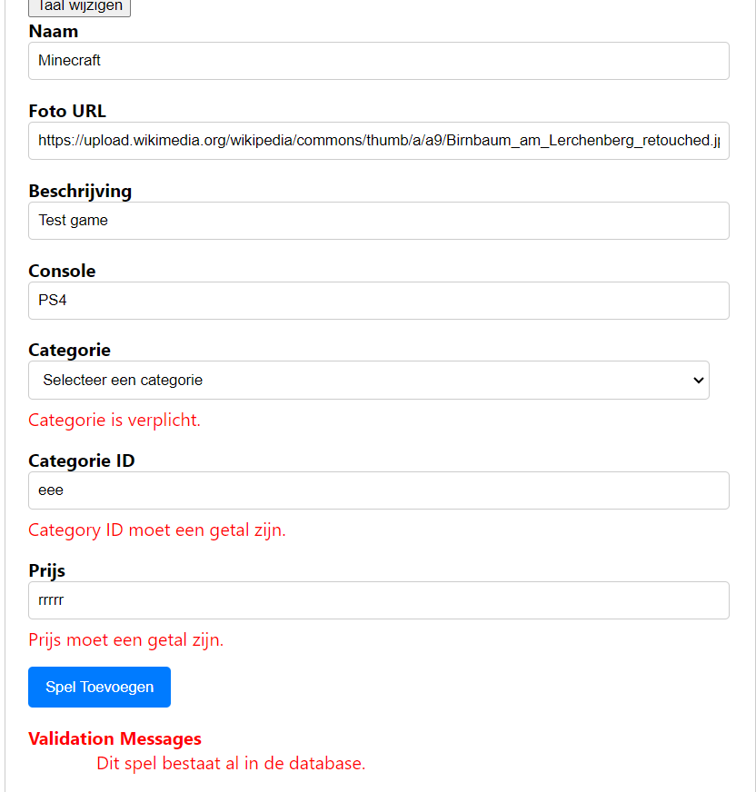
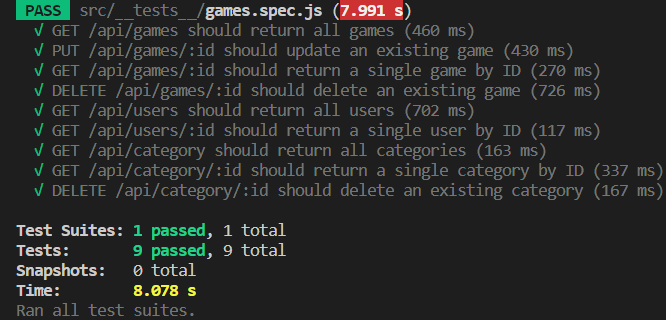

# Wout Van Cleemput (202181098)

- [X] Web Services: [GITHUB URL](https://github.com/Web-IV/2324-webservices-WoutVC)
  - [GitHub repository](github.com/HOGENT-Web)
  - [Online versie](github.com/HOGENT-Web)

**Logingegevens**

- Gebruikersnaam/e-mailadres: e2e-testing@gameapp.be
- Wachtwoord: Test1234!

## Projectbeschrijving

Mijn project gaat over een website dat games verkoopt. 

## Screenshots

> Voeg enkele (nuttige!) screenshots toe die tonen wat de app doet.

## API calls

### Categories

- `GET /api/categories`: alle categorieën ophalen
- `GET /api/categories/:id`: categorie met een bepaald id ophalen
- `POST /api/categories`: een nieuwe categorie toevoegen
- `PUT /api/categories/:id`: een bestaande categorie bijwerken
- `DELETE /api/categories/:id`: een categorie verwijderen

### Games

- `GET /api/games`: alle games ophalen
- `GET /api/games/:id`: game met een bepaald id ophalen
- `POST /api/games`: een nieuwe game toevoegen
- `PUT /api/games/:id`: een bestaande game bijwerken
- `DELETE /api/games/:id`: een game verwijderen

### Gebruikers

- `GET /api/users`: alle gebruikers ophalen
- `GET /api/users/:id`: gebruiker met een bepaald ID ophalen
- `POST /api/users`: een nieuwe gebruiker toevoegen
- `PUT /api/users/:id`: een bestaande gebruiker bijwerken
- `DELETE /api/users/:id`: een gebruiker verwijderen
- `GET /api/users/:id/games`: Haal de games op die aan een gebruiker zijn gekoppeld.
  

## Behaalde minimumvereisten

### Web Services

- **datalaag**

  - [X] voldoende complex (meer dan één tabel, 2 een-op-veel of veel-op-veel relaties)
  - [X] één module beheert de connectie + connectie wordt gesloten bij sluiten server
  - [X] heeft migraties - indien van toepassing
  - [X] heeft seeds
 

- **repositorylaag**

  - [X] definieert één repository per entiteit (niet voor tussentabellen) - indien van toepassing
  - [X] mapt OO-rijke data naar relationele tabellen en vice versa - indien van toepassing
 

- **servicelaag met een zekere complexiteit**

  - [X] bevat alle domeinlogica
  - [X] bevat geen SQL-queries of databank-gerelateerde code
 

- **REST-laag**

  - [X] meerdere routes met invoervalidatie
  - [X] degelijke foutboodschappen
  - [X] volgt de conventies van een RESTful API
  - [X] bevat geen domeinlogica
  - [X] geen API calls voor entiteiten die geen zin hebben zonder hun ouder (bvb tussentabellen)
  - [ ] degelijke authorisatie/authenticatie op alle routes
 

- **algemeen**

  - [X] er is een minimum aan logging voorzien
  - [X] een aantal niet-triviale integratietesten (min. 1 controller >=80% coverage)
  - [X] minstens één extra technologie
  - [X] maakt gebruik van de laatste ES-features (async/await, object destructuring, spread operator...)
  - [X] duidelijke en volledige README.md
  - [X] volledig en tijdig ingediend dossier en voldoende commits (de meeste commits zijn nog van vorig jaar https://github.com/Web-IV/2223-webservices-WoutVC)

## Projectstructuur

### Web Services

C:.
|   createServer.js
|   index.js
|   
+---core
|       logging.js
|       serviceError.js
|       
+---data
|   |   index.js
|   |   
|   +---migrations
|   |       202212201521_createGameTable.js
|   |       202304251635_createCategoryTable.js
|   |       202312221455_createUserTable
|   |       
|   \---seeds
|           202105251900_resetDb.js
|           202212201527_games.js
|           202304251636_category.js
|           202312221455_users
|
+---models
|       Category.js
|       Game.js
|       sequalize.js
|       User.js
|       
+---repository
|       category.js
|       game.js
|       user.js
|       
+---rest
|       index.js
|       _categories.js
|       _games.js
|       _health.js
|       _validation.js
|       _users.js
|       
+---service
|       category.js
|       game.js
|       health.js
|       user.js
|
\---__tests__
        games.spec.js

## Extra technologie

### Web Services

Voor web services heb ik met eslint gewerkt en geprobeert met sequalize te werken maar enkel eslint werkt.

https://www.npmjs.com/package/eslint
(https://sequelize.org/docs/v6/getting-started/)

## Testresultaten

### Web Services

Het test of er games, users en categories toegevoegd kunnen worden en verwijderd.
Er wordt ook getest als je een game kunt krijgen met alleen een id te geven,
en of het mogelijk is om een game bij te werken (updaten).

Voor de users en categorieën wordt er getest als je alle users/categorieën kan zien en dat je een user/categorie kan zien met een bepaalde id.

## Gekende bugs

### Web Services

- Sequalize en swagger werkt niet

## Wat is er verbeterd/aangepast?

### Web Services

- Geprobeert om swagger te implementeren
- 8 testen toegevoegd
- De User entiteit toegevoegd
